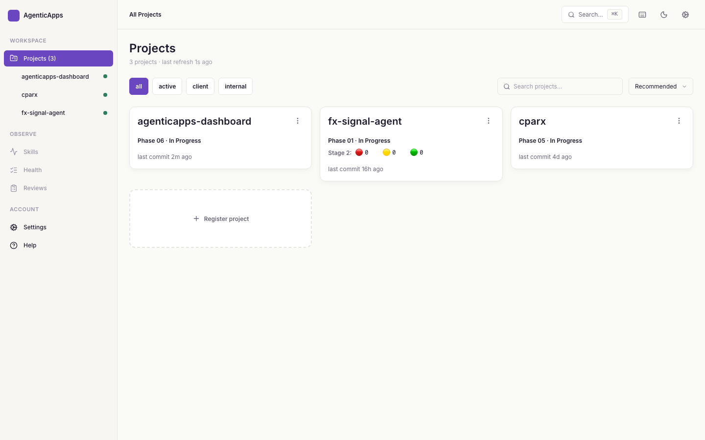
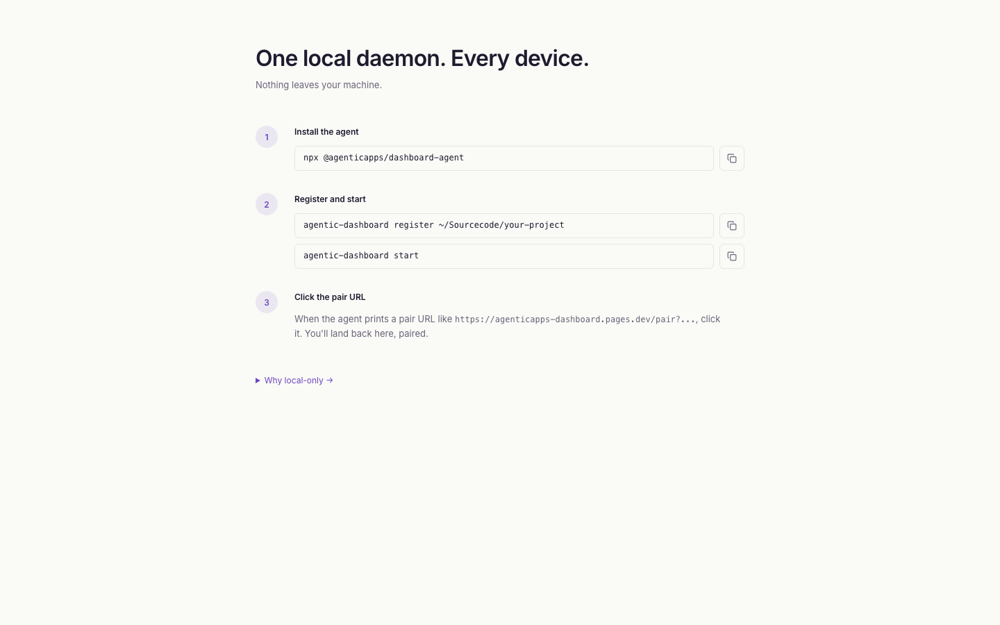
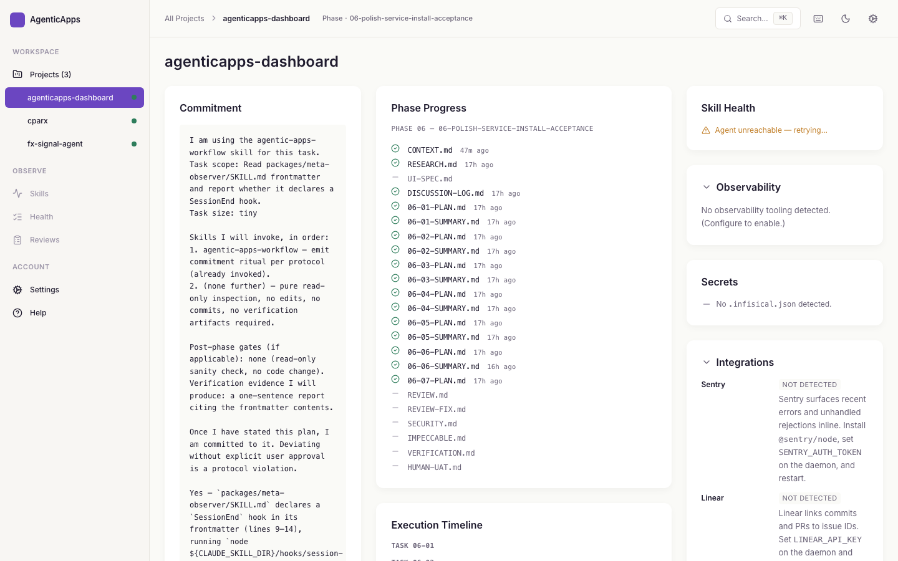

# AgenticApps Pipeline Dashboard

> **Alpha — v1.0 closing.** Phases 0–6 ship a complete, useful dashboard with zero third-party service dependencies. Desktop-only in v1.0; mobile/tablet support deferred to v1.1+.



A registry-based dashboard that visualizes the running state of the AgenticApps Superpowers + GSD + gstack pipeline across every registered project — from any device, while keeping all data on your own machine. A local daemon serves project state from your filesystem; a static SPA on Cloudflare Pages renders it. No cloud-side storage. No native dependencies. Read-only against your projects.

## Install

Three commands to get a paired dashboard running:

```bash
npx @agenticapps/dashboard-agent register ~/Sourcecode/your-first-project
npx @agenticapps/dashboard-agent start
# click the printed pair URL
```

Optional — install as a persistent service that survives reboot:

```bash
# macOS:
npx @agenticapps/dashboard-agent install-launchd
# then run the printed `launchctl load` command

# Linux:
npx @agenticapps/dashboard-agent install-systemd
# then run the printed `systemctl --user enable --now` command
```

Both commands write a user-mode unit only (no root). See [`packages/agent/src/cli/installLaunchd.ts`](packages/agent/src/cli/installLaunchd.ts) and [`installSystemd.ts`](packages/agent/src/cli/installSystemd.ts) for the exact file contents. Each command also exposes `--uninstall` for symmetry.

## Pair



On first start, the agent prints a one-click pair URL like `https://agenticapps-dashboard.pages.dev/pair?agent=…&token=…`. Open it in your browser; the SPA validates the agent, stores the credentials in `localStorage`, and redirects to the multi-project home.

Manual fallback: open `https://agenticapps-dashboard.pages.dev/settings`, paste the agent URL + token by hand. Useful when the printed URL didn't survive your terminal copy, or when re-pairing after `agentic-dashboard rotate-token`.

Multi-device access: bind the agent to your Tailscale hostname (`agentic-dashboard start --bind tailscale`) and point a second browser at the same SPA URL. The daemon still runs on one machine; the SPA just talks to it over Tailscale.

## FAQ

1. **Why is the daemon on `127.0.0.1:5193` by default?** Loopback keeps the dashboard local-only by accident — you have to opt in to multi-device access. Use `--bind tailscale` for Tailscale-only access, or `--bind 0.0.0.0` for LAN access (emits a security banner).

2. **Can I access from another device?** Yes, via Tailscale (`--bind tailscale`) or LAN (`--bind 0.0.0.0`). Both require the SPA to point at the new agent URL via `/settings` re-pair.

3. **What data does the dashboard read?** Only `.planning/`, `.claude/`, and `git log` per registered project, plus `~/.claude/skills/` globally. The path allow-list rejects `..` and absolute paths outside the registered root. Read-only — the daemon never writes to a registered project.

4. **How do I rotate my auth token?** `agentic-dashboard rotate-token`. The old token is invalid immediately; the SPA detects the 401 and shows a re-pair banner.

5. **Why is there no cloud component?** Architectural commitment. The registry, auth tokens, and project data all stay on your machine. The SPA on Cloudflare Pages is pure-static HTML/JS — no Workers, no Pages Functions, no analytics.

6. **How do I register multiple projects?** `agentic-dashboard register <path>` once per project, OR `agentic-dashboard register --auto <parent-dir>` to scan a parent directory and confirm each match.

7. **What is "impeccable critique" and why is it a CI gate?** A dogfooded design QA. The dashboard's own UI must score ≥ 87 on `impeccable:critique` at the lg (1440×900) breakpoint before merging to main — enforced by [`.github/workflows/impeccable.yml`](.github/workflows/impeccable.yml). v1.1 commits to lifting the floor to ≥ 90.

8. **Does this work on Windows?** Not in v1.0. macOS (LaunchAgent) and Linux (systemd) only. The Windows install path is deferred to v2 or beyond.

## Troubleshooting



1. **"Daemon unreachable" inline state.** The daemon is not running on the agent URL the SPA has stored. Run `agentic-dashboard start`. If it was installed as a service, run `launchctl load ~/Library/LaunchAgents/eu.agenticapps.dashboard.plist` (macOS) or `systemctl --user start eu.agenticapps.dashboard` (Linux).

2. **"Auth token expired" + re-pair banner.** Token rotated either manually (`rotate-token`) or by 30-day auto-rotation. Run `agentic-dashboard pair` to print a fresh pair URL, then click it.

3. **"Schema drift" panel state.** The SPA is running an older bundle than the daemon. Hard-refresh the browser (Cmd+Shift+R / Ctrl+Shift+R). If it persists, the deployed SPA may be behind the daemon — check the production deploy.

4. **LaunchAgent runs but daemon immediately exits (macOS).** Almost always a PATH problem. Check `~/.agenticapps/dashboard/logs/error.log`. The generated plist's `EnvironmentVariables.PATH` includes `/opt/homebrew/bin:/usr/local/bin:/usr/bin:/bin` by default; if your `node` lives outside those (e.g. NVM under `~/.nvm/versions/node/...`), the plist needs the right PATH prepended. Edit the plist, then `launchctl unload ~/Library/LaunchAgents/eu.agenticapps.dashboard.plist && launchctl load ~/Library/LaunchAgents/eu.agenticapps.dashboard.plist`.

5. **systemd unit fails to start on older Linux (Ubuntu 18.04 / Debian 9).** The unit uses `StandardOutput=append:` which requires systemd ≥ 240. On older systems, edit `~/.config/systemd/user/eu.agenticapps.dashboard.service` and change both `append:` lines to `file:` (truncates on each restart instead of appending). Then `systemctl --user daemon-reload && systemctl --user restart eu.agenticapps.dashboard`.

6. **Windows: "command not found".** Windows is not supported in v1.0 (`install-windows-service` deferred to v2). Run on macOS or Linux. WSL2 with a systemd-enabled distro works as the Linux path.

## Architecture

Three-package pnpm workspace:

- **`packages/spa`** — Vite + React + Tailwind static SPA, hosted on Cloudflare Pages (`agenticapps-dashboard.pages.dev`). No data stored cloud-side; the SPA only renders what your local daemon serves.
- **`packages/agent`** — Node 20+ local daemon (Hono), reads `.planning/`, `.claude/`, and `git log` per registered project. Loopback default, bearer-token auth, `0600` config files, no native dependencies.
- **`packages/shared`** — Zod schemas + TS types, single source of truth for daemon ↔ SPA wire shapes. Both ends validate against the same schema; mismatches surface as a visible "schema drift" panel state in the SPA.

Full spec: [`docs/spec/dashboard-prompt.md`](docs/spec/dashboard-prompt.md). Deploy notes: [`docs/deploy/`](docs/deploy/). Two-stage review protocol: [`docs/review-protocol.md`](docs/review-protocol.md). CF Access policy: [`docs/deploy/cf-access-policy.md`](docs/deploy/cf-access-policy.md).

## Development

Requirements: Node 22+ (LTS — `.nvmrc` pins major 22, satisfies pnpm 10's `node:sqlite` minimum), pnpm 9.5+.

```bash
pnpm install
pnpm lint
pnpm typecheck
pnpm test
pnpm build
```

Per-package commands use `--filter`:

```bash
pnpm --filter @agenticapps/dashboard-spa dev      # SPA on http://localhost:5174
pnpm --filter @agenticapps/dashboard-agent build  # Build the CLI bundle
pnpm --filter @agenticapps/dashboard-agent test   # Run agent tests only
```

CI runs the same five gates (install + lint + typecheck + test + build) on push and PR — see [`.github/workflows/ci.yml`](.github/workflows/ci.yml). The `Impeccable Critique Gate` workflow enforces the dogfooded ≥ 87 design floor on `main` as a required check. Releases trigger on `v*` tag push — see [`.github/workflows/release.yml`](.github/workflows/release.yml).

## License

Currently UNLICENSED (no LICENSE file). The repo is private through Phase 6; an MIT LICENSE lands at Phase 8 with the public-readiness flip. Source-available; license decision is deferred to Phase 8.
