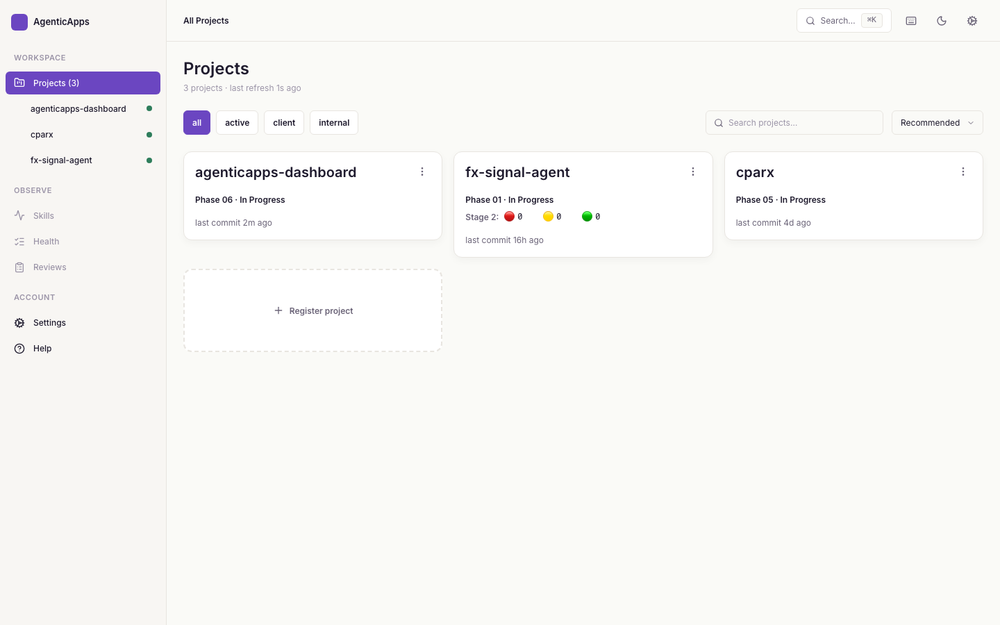
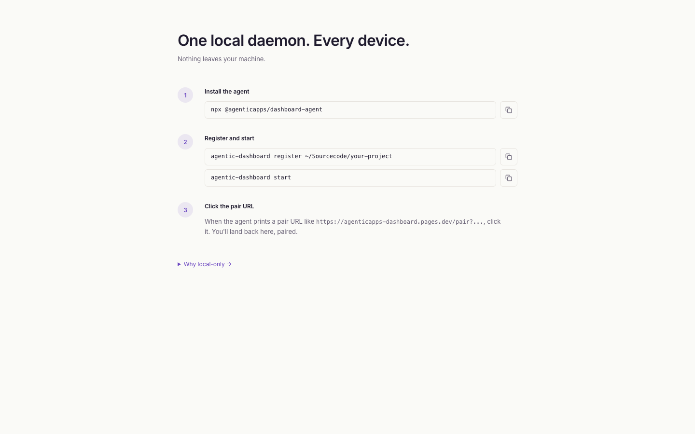
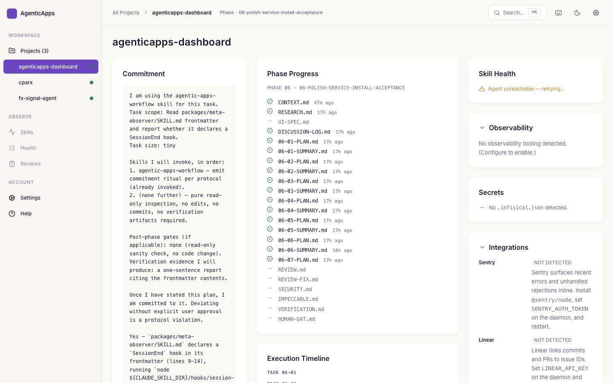

# AgenticApps Pipeline Dashboard

> # ⚠️ Retired — 2026-08-05
>
> **This project is archived and is not maintained.** Do not install it. The
> daemon holds a bearer token and read access to every registered project's
> filesystem; running an unmaintained copy is a security surface nobody is
> watching.
>
> **Why:** it worked, and it was never used. Three repos were ever registered
> (one of them this one), no repo ever supplied the tier-B evidence file that
> four of the six readiness checks require, and roughly 100,000 lines of source,
> tests and spec prose accumulated in three months for a fleet of two. More
> fundamentally, the product is read-only by constitution — it renders state for
> a human to read, who then opens a terminal and asks an agent to act. An agent
> that reads the repo directly collapses both hops and can act on what it finds.
>
> The full reasoning, the measurements behind it, the alternatives rejected, and
> what is worth stealing from here:
> **[ADR-0004 — Retire the dashboard](docs/decisions/0004-retire-the-dashboard.md)**.
>
> **If you are looking for one thing to take:** ancestry-based freshness, in
> [`packages/agent/src/lib/readiness/freshness.ts`](packages/agent/src/lib/readiness/freshness.ts)
> (42 lines). Evidence is stale when the last commit touching production code is
> not an ancestor of the evidence commit — never when a timestamp looks old,
> because a fresh clone stamps every file with checkout time and makes stale
> evidence look current.
>
> The `@agenticapps/dashboard-agent` npm package is deprecated, not unpublished,
> so existing lockfiles keep resolving.

---

*Everything below describes the product as it stood and is kept for reference.*



A registry-based dashboard that visualizes the running state of the AgenticApps Superpowers + GSD + gstack pipeline across every registered project — from any device, while keeping all data on your own machine. A local daemon serves project state from your filesystem; a static SPA on Cloudflare Pages renders it. No cloud-side storage. No native dependencies. Read-only against your projects.

## Install

Three commands to get a paired dashboard running:

```bash
npx @agenticapps/dashboard-agent register ~/Sourcecode/your-first-project
npx @agenticapps/dashboard-agent start
# click the printed pair URL
```

Optional — install as a persistent service that survives reboot:

```bash
# macOS:
npx @agenticapps/dashboard-agent install-launchd
# then run the printed `launchctl load` command

# Linux:
npx @agenticapps/dashboard-agent install-systemd
# then run the printed `systemctl --user enable --now` command
```

Both commands write a user-mode unit only (no root). See [`packages/agent/src/cli/installLaunchd.ts`](packages/agent/src/cli/installLaunchd.ts) and [`installSystemd.ts`](packages/agent/src/cli/installSystemd.ts) for the exact file contents. Each command also exposes `--uninstall` for symmetry.

## Pair



On first start, the agent prints a one-click pair URL like `https://agenticapps-dashboard.pages.dev/pair?agent=…&token=…`. Open it in your browser; the SPA validates the agent, stores the credentials in `localStorage`, and redirects to the multi-project home.

Manual fallback: open `https://agenticapps-dashboard.pages.dev/settings`, paste the agent URL + token by hand. Useful when the printed URL didn't survive your terminal copy, or when re-pairing after `agentic-dashboard rotate-token`.

Multi-device access: bind the agent to your Tailscale hostname (`agentic-dashboard start --bind tailscale`) and point a second browser at the same SPA URL. The daemon still runs on one machine; the SPA just talks to it over Tailscale.

**The tailnet boundary is IPv4-only.** When the daemon is reachable beyond loopback it admits only Tailscale's CGNAT IPv4 range, `100.64.0.0/10` — in dotted-quad or IPv6-mapped form. A raw IPv6 peer is refused, including one from your tailnet's own IPv6 range. Both machines therefore need IPv4 enabled on Tailscale, and the second device must reach the daemon at its CGNAT IPv4 address (or the MagicDNS name that resolves to it). See [ADR 0002](docs/decisions/0002-tailnet-ipv6-policy.md).

## FAQ

1. **Why is the daemon on `127.0.0.1:5193` by default?** Loopback keeps the dashboard local-only by accident — you have to opt in to multi-device access. Use `--bind tailscale` for Tailscale-only access, or `--bind 0.0.0.0` for LAN access (emits a security banner).

   `--bind` also accepts an explicit IPv4 or IPv6 literal. `127.0.0.1` and `::1` are loopback and install no boundary. `0.0.0.0` and `::` bind all interfaces, print the security banner, and enforce the CIDR boundary. Any other IPv4 literal is treated as non-loopback and enforced by default. Any other IPv6 literal is **refused at startup**, because the boundary is IPv4-only and such a daemon would serve nobody — see Troubleshooting 6. Hostnames are not accepted.

2. **Can I access from another device?** Yes, via Tailscale (`--bind tailscale`) or LAN (`--bind 0.0.0.0`). Both require the SPA to point at the new agent URL via `/settings` re-pair.

3. **Does this work on an IPv6-only tailnet?** No. Running Tailscale with IPv4 disabled is a supported upstream configuration that this daemon does not support: its admission boundary accepts only CGNAT IPv4. Keep IPv4 enabled on both the daemon node and the client node and connect over the CGNAT IPv4 address. Widening the boundary to tailnet IPv6 is deliberately deferred — see [ADR 0002](docs/decisions/0002-tailnet-ipv6-policy.md).

4. **Why did `--bind 0.0.0.0` refuse a request from my own machine?** Because enforcement follows the bind mode, not the source of the individual request. On `0.0.0.0` or `::` the CIDR boundary applies to every request, including one arriving from `127.0.0.1`, so a local `curl` is refused with `cidr_violation` unless you pass `--no-enforce-cidr`. Use the default `127.0.0.1` bind for local-only work.

5. **What data does the dashboard read?** Only `.planning/`, `.claude/`, and `git log` per registered project, plus `~/.claude/skills/` globally. The path allow-list rejects `..` and absolute paths outside the registered root. Read-only — the daemon never writes to a registered project.

6. **How do I rotate my auth token?** `agentic-dashboard rotate-token`. The old token is invalid immediately; the SPA detects the 401 and shows a re-pair banner.

7. **Why is there no cloud component?** Architectural commitment. The registry, auth tokens, and project data all stay on your machine. The SPA on Cloudflare Pages is pure-static HTML/JS — no Workers, no Pages Functions, no analytics.

8. **How do I register multiple projects?** `agentic-dashboard register <path>` once per project, OR `agentic-dashboard register --auto <parent-dir>` to scan a parent directory and confirm each match.

9. **What is "impeccable critique" and is it a CI gate?** A dogfooded design QA — but no, it is not a CI gate. The dashboard's own UI must score a composite ≥ 80 on `impeccable:critique` at the lg (1440×900) breakpoint, with a structural-debt waiver clause for a route structurally below floor. Enforcement is a **per-change artifact gate**: every frontend-touching change commits the critique artifact (composite + per-heuristic scores, findings, persona red flags) into its change directory, and a reviewer reads it. There is no `impeccable.yml` workflow; the CI gate was retired in favour of that artifact, and the composite is an LLM-driven heuristic score rather than a deterministic CLI, so it is not mechanizable as a check today. The floor and its process live in [`CLAUDE.md`](CLAUDE.md); the product outcomes it protects live in [`openspec/specs/design-system`](openspec/specs/design-system/spec.md).

10. **Does this work on Windows?** Not in v1.0. macOS (LaunchAgent) and Linux (systemd) only. The Windows install path is deferred to v2 or beyond.

9. **Can the workflow repositories live somewhere else?** Yes. Set `AGENTICAPPS_WORKFLOW_SOURCE_ROOT` before starting the daemon to relocate the fixed five-repository workflow family. The value changes only the parent directory; repository names and harness paths remain fixed by the daemon.

## Troubleshooting



1. **"Daemon unreachable" inline state.** The daemon is not running on the agent URL the SPA has stored. Run `agentic-dashboard start`. If it was installed as a service, run `launchctl load ~/Library/LaunchAgents/eu.agenticapps.dashboard.plist` (macOS) or `systemctl --user start eu.agenticapps.dashboard` (Linux).

2. **"Auth token expired" + re-pair banner.** Token rotated either manually (`rotate-token`) or by 30-day auto-rotation. Run `agentic-dashboard pair` to print a fresh pair URL, then click it.

3. **"Schema drift" panel state.** The SPA is running an older bundle than the daemon. Hard-refresh the browser (Cmd+Shift+R / Ctrl+Shift+R). If it persists, the deployed SPA may be behind the daemon — check the production deploy.

4. **LaunchAgent runs but daemon immediately exits (macOS).** Almost always a PATH problem. Check `~/.agenticapps/dashboard/logs/error.log`. The generated plist's `EnvironmentVariables.PATH` includes `/opt/homebrew/bin:/usr/local/bin:/usr/bin:/bin` by default; if your `node` lives outside those (e.g. NVM under `~/.nvm/versions/node/...`), the plist needs the right PATH prepended. Edit the plist, then `launchctl unload ~/Library/LaunchAgents/eu.agenticapps.dashboard.plist && launchctl load ~/Library/LaunchAgents/eu.agenticapps.dashboard.plist`.

5. **systemd unit fails to start on older Linux (Ubuntu 18.04 / Debian 9).** The unit uses `StandardOutput=append:` which requires systemd ≥ 240. On older systems, edit `~/.config/systemd/user/eu.agenticapps.dashboard.service` and change both `append:` lines to `file:` (truncates on each restart instead of appending). Then `systemctl --user daemon-reload && systemctl --user restart eu.agenticapps.dashboard`.

6. **`--bind <ipv6-address>` refuses to start.** Expected. The admission boundary is IPv4-only, so a daemon on a specific IPv6 address would start cleanly and then refuse every peer that reached it — it fails before startup instead. Bind the node's CGNAT IPv4 address or use `--bind tailscale`. If you genuinely want that bind, `--no-enforce-cidr` permits it, which disables the boundary entirely: both the range rule and the address-family rule stop applying, so any peer that can route to the address is admitted. `::` is exempt because it can serve IPv6-mapped CGNAT IPv4 peers; it starts, warns, and enforces.

7. **`--bind tailscale` says this node has no CGNAT IPv4 address.** Tailscale is installed and running — the node just has no IPv4 address to bind, usually because IPv4 is disabled for it. That is a different problem from "Tailscale not detected", which means the binary or daemon is unavailable. Enable IPv4 on this node in the Tailscale admin console, then restart the daemon.

8. **Windows: "command not found".** Windows is not supported in v1.0 (`install-windows-service` deferred to v2). Run on macOS or Linux. WSL2 with a systemd-enabled distro works as the Linux path.

## Architecture

Three-package pnpm workspace:

- **`packages/spa`** — Vite + React + Tailwind static SPA, hosted on Cloudflare Pages (`agenticapps-dashboard.pages.dev`). No data stored cloud-side; the SPA only renders what your local daemon serves.
- **`packages/agent`** — Node 20+ local daemon (Hono), reads `.planning/`, `.claude/`, and `git log` per registered project. Loopback default, bearer-token auth, `0600` config files, no native dependencies.
- **`packages/shared`** — Zod schemas + TS types, single source of truth for daemon ↔ SPA wire shapes. Both ends validate against the same schema; mismatches surface as a visible "schema drift" panel state in the SPA.

Full spec: [`docs/spec/dashboard-prompt.md`](docs/spec/dashboard-prompt.md). Deploy notes: [`docs/deploy/`](docs/deploy/). Two-stage review protocol: [`docs/review-protocol.md`](docs/review-protocol.md). CF Access policy: [`docs/deploy/cf-access-policy.md`](docs/deploy/cf-access-policy.md).

## Development

Requirements: Node 22+ (LTS — `.nvmrc` pins major 22, satisfies pnpm 10's `node:sqlite` minimum), pnpm 9.5+.

```bash
pnpm install
pnpm lint
pnpm typecheck
pnpm test
pnpm build
```

Per-package commands use `--filter`:

```bash
pnpm --filter @agenticapps/dashboard-spa dev      # SPA on http://localhost:5174
pnpm --filter @agenticapps/dashboard-agent build  # Build the CLI bundle
pnpm --filter @agenticapps/dashboard-agent test   # Run agent tests only
```

CI runs the same five gates (install + lint + typecheck + test + build) on push and PR — see [`.github/workflows/ci.yml`](.github/workflows/ci.yml); lint runs under `--max-warnings 0`, so a warning fails the build. The design floor is **not** a CI check — see FAQ 9 above. Releases trigger on `v*` tag push — see [`.github/workflows/release.yml`](.github/workflows/release.yml).

## License

Currently UNLICENSED (no LICENSE file). The repo is private through Phase 6; an MIT LICENSE lands at Phase 8 with the public-readiness flip. Source-available; license decision is deferred to Phase 8.
